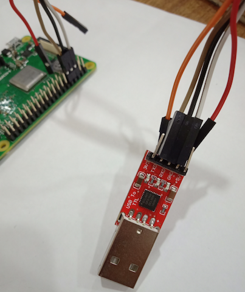
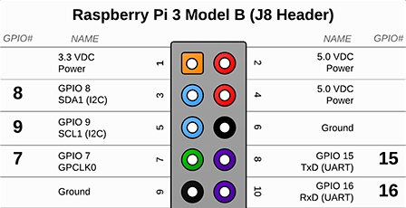
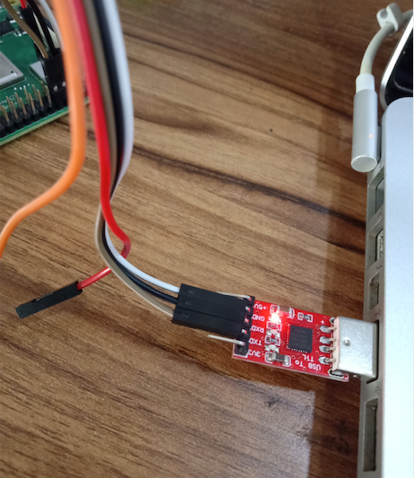
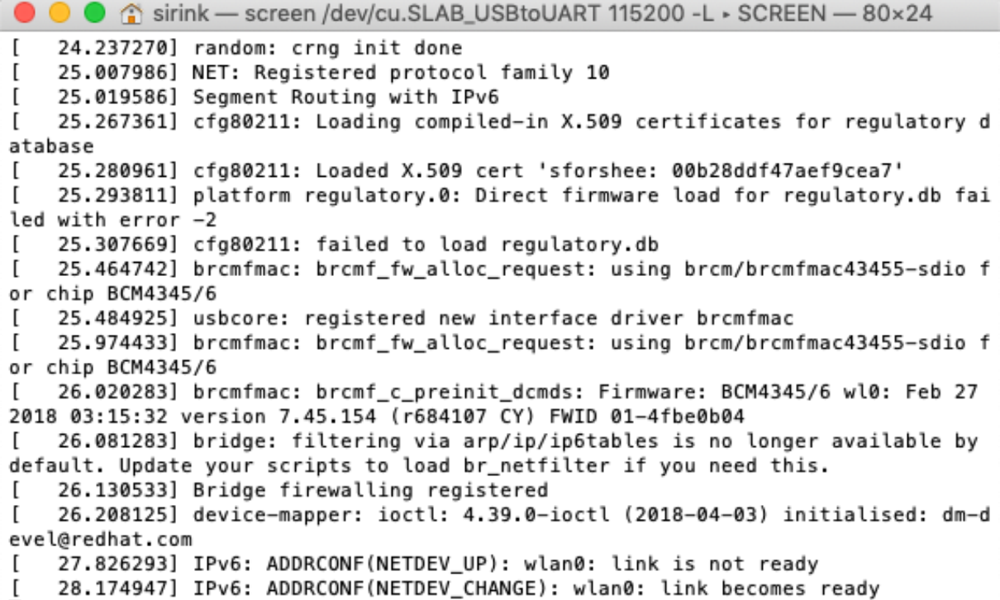

# Troubleshooting

## Board does not Boot

If the RPi3 ACT led (green) is not blinking, you may be facing a boot problem.

To check if the device flashed properly. Turn off your RPi3, remove the SD card and insert it in your computer. The SD card should have two partitions, `pvboot` and `pvroot`. If it doesn't, then go back to the [image setup](image-setup-rpi3.md) instructions and try again.

To eliminate any hardware issues, try flashing your device with one of the Raspberri Pi initial images like this one: [NOOBS](https://www.raspberrypi.org/documentation/installation/noobs.md).

## Board Boots Up but does not Connect to LAN

If the RPi3 ACT led (green) is blinking, but the ethernet led (orange) is not blinking, you can see more logs during the boot process via TTY. TTY debugging needs a Pantavisor image built using the [debug](build-options.md) build option. You can use HDMI (just to check the logs) or TTY to check the logs and display a [debug console](inspect-device.md#tty).

### HDMI cable

Connect an HDMI cable to the Raspberry Pi before booting will display the kernel log when the board starts.


### TTY

Connect the Raspberry Pi board to a USB-to-TLL board (or similar) with the following configuration:

|Raspberry Pi Board | USB to TTL|
|-------------------|-----------|
|Pin 6 | GND|
|Pin 8 | RXD|
|Pin 10 | TXD|



To Identify the Pins(6,8 & 10) on the board, please check below:



Then connect the USB-to-TTL board to your computer:



After this, these are the preparations you have to made in each OS before booting up the device.

#### Linux

List serial lines with the `dmesg` command to identify which `/dev/ttyX` device corresponds with the connected USB-to-TLL board. After identifying the device, then start minicom with said device as a parameter:

```
dmesg | grep tty
sudo minicom /dev/ttyX
```

#### Mac OS

First install the CP210x USB to UART Bridge VCP drivers:

 * Download link: [CP210x USB to UART Bridge VCP Driver for Mac OS](https://www.silabs.com/documents/public/software/Mac_OSX_VCP_Driver.zip)

Verify the USB-to-TLL board can be detected by your computer:

```
$ ls /dev/cu*
> cu.SLAB_USBtoUART
```

Next detect data from the serial cable with:  ```screen```

```
screen /dev/cu.SLAB_USBtoUART 115200 -L
```

You will see a blank terminal waiting for the Raspberry Pi's input. Now it is time to turn it on.



## Board Connect to LAN but pvr scan does non Detect Device

If no devices are detected, try running through this check-list:

* both your Raspberry Pi and your computer are connected to the same network
* mDNS packets are allowed in your router and port 5353 is open on your computer firewall
* access your router admin settings and check that DHCP has served an IP to the board and that you can ping it
