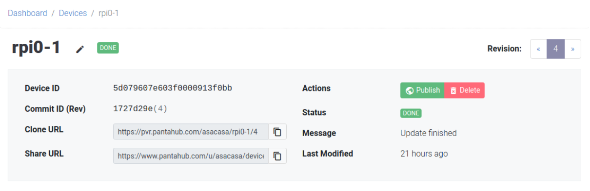

# Choose your Target

:::note
This guide focuses on building Pantavisor from source code. If you do not need to compile Pantavisor, pre-compiled Pantavisor images are available for all supported targets in our [download](initial-devices.md) page.
:::

Currently supported targets are:

* aarch64-appengine
* aarch64-generic
* arm-appengine
* arm-bpi-r2
* arm-bpi-r64
* arm-generic
* arm-odroid-c2
* arm-toradex-colibri-imx6_7
* beaglev
* nv-tegra-4_9
* malta-qemu
* mips-appengine
* mips-generic
* rock64
* rpi0w-5.10.y
* rpi64-5.10.y
* x64-appengine
* x64-generic
* x64-ubuntu
* x64-uefi

Note down the `Target` value of your initial device. For our example, that would be:

```
rpi64-5.10.y
```

This will be enough if you only want to build the [BSP](bsp.md), which you can then use to [update a Pantavisor-enabled device](choose-way.md). In that case, you can [continue](get-source-code.md) to the next page of this guide.

## Choose your Reference Device

If what to want is to build a [flashable image](get-source-code.md), you will also need a Pantavisor reference device. The final image will contain the BSP generated from source code plus the containers imported from that device. This Pantavisor reference device can be either stored in Pantacor Hub or locally in your machine. By default, if no reference device is specified, the build system will generate an image with no containers (therefore, no network management and no functionality).

For instance, if you want to produce an image that has the same app stack than one of your online devices, you would use the pvr `clone URL` of that device as a parameter to build pantavisor. If you do not have your own custom device developed yet, you can use any of our initial devices as your starting point:

```
https://pvr.pantahub.com/pantahub-ci/rpi64_5_10_y_initial_latest
```

You can get this and other reference devices in our [initial devices page](initial-devices.md), in the `Pantacor Hub devices` column of the table.

If you rather want to use one of the devices that you have developed and burn an image from it, you would go to your device details page on https://www.pantahub.com and get the pvr ```Clone URL``` from there:



As previously stated, you can also use a device that is already [cloned](clone-your-system.md) in your machine. In this case, you would use the path to the cloned device checkout plus the ```.pvr``` suffix. For example:

```
/home/anibal/pantacor/src/devices/rpi64_5_10_y_initial_latest/.pvr
```
