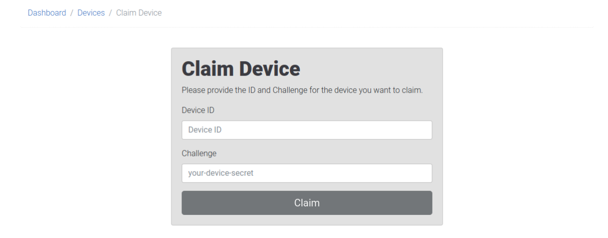

# Claim your Device

The first step to remotely manage your device is to claim it. Claiming is the process of linking a newly flashed device and a [Pantacor Hub account](register-user.md).

:::note
For this how-to guide, it is assumed that you are [registered in Pantacor Hub](register-user.md).
:::

To claim a device, it must meet some pre-requisites:

* The board has to be connected to an internet-facing network.
* The device was not previously claimed.
* One of this must be true:
    * It must be running revision 0, which should happen in any newly flashed device
    * If running a [local revision](pantavisor-commands.md#steps), the [go remote command](pantavisor-commands.md) must be executed.

There are three ways to claim your device, depending on the capabilities of the target image you just installed: automatically, manually from the host and manually from the target.

## Automatically

This process can be done automatically if the pairing option is set in the [download Pantavisor image page](choose-image.md#from-pantacor-hub).

## Manually from the Device

Manually claiming a device from the device itself will depend on where you are on the device, that is, if you have access to a [pvr-sdk](initial-devices.md#about-pantavisor-initial-devices) container running on top of your Pantavisor-enable device or if you have access to the Pantavisor file system.

### Using Pantabox

This is the easiest way if you have downloaded a [non-personalized image](choose-image.md#non-registering-option) that has the [pvr-sdk](initial-devices.md#about-pantavisor-initial-devices) container.

This container has the [Pantabox](local-control.md#pantabox) tool installed by default. To claim the device, just [inspect](inspect-device.md) your device from your host computer and execute the [pantabox-claim](pvr-sdk/reference/pantabox-claim.md) command. The script will take care of the pairing process.

### Getting Credentials from Pantavisor File System

This is the way if you are running Pantavisor using [QEMU](image-setup.md#qemu) or with [App Engine](requirements-appengine.md) images.

The credentials to claim your device are located in these files inside of the Pantavisor file system:

```
# cat /pv/challenge
pleasantly-finer-unicorn
# cat /pv/device-id
5b582638c67920b9de2
```

:::note
This information will also be printed in [pantavisor log](storage.md#logs).
:::

You will need to insert those credentials in Pantacor Hub. Just click on the `Devices` tab on the left side of the UI and press the blue `Claim a Device` button that will appear on the right side.



## Manually from the Host

As using a CLI tool can be more convenient than doing it from the device itself, we offer the possibility to claim your device using the [pvr](install-pvr.md) tool, if the image that you just flashed has the [pv-avahi](initial-devices.md#about-pantavisor-initial-devices) container.

Assuming your computer is in the same local network as your board, just execute this command to discover the device:

```
pvr device scan
```


If `pvr` finds a device on the local network, it will present this metadata for you to claim it via the command quoted in the output. Just run that command as-is and your user should now own your device.
