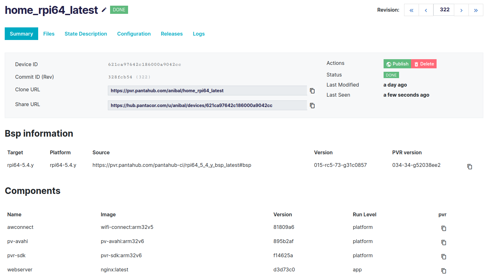

# Clone Your Systems

The first step to start making modifications to your new device using `pvr` is always to `clone` any of the [revisions](revisions.md) of it or of any other device. This is done one way or another depending on whether you aim to manage your device [locally](local-control.md) or [remotely](remote-control.md). Once the revision is cloned, modification and deployment to the device will be done the same way for both paths from the `pvr` user point of view.

## From Pantacor Hub cloud

Pantavisor-enabled systems automatically sync their revisions on first contact with their Pantacor Hub instance immediately after being [claimed](claim-device.md).



To clone a device, copy the `pvr` `Clone URL` that appears in the Pantacor Hub device dashboard:

```
pvr clone https://pvr.pantahub.com/user1/device1 my-checkout
```

After executing this, ```pvr``` asks you to log in, then it downloads the objects and unpacks them locally on disk.

## From the Device Itself

You can also clone the current running revision of a device that is connected to your local network if the pvtx API is [opened](pvtx-open-api.md).

First, you will need to know your device IP, which is possible with [pvr](pvr-discover-device.md).

After that, just clone the revision into your computer with this command:

```
pvr clone 192.168.1.122 my-checkout
```
