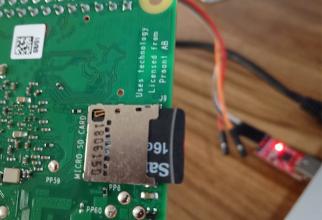
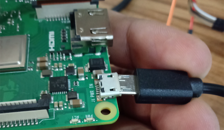
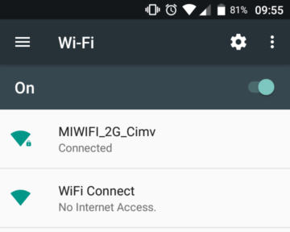
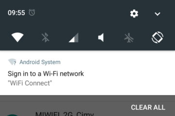
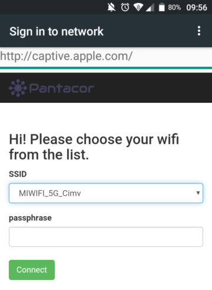
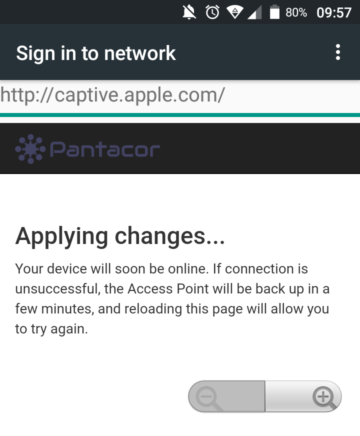
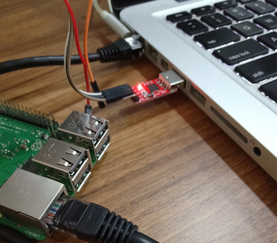
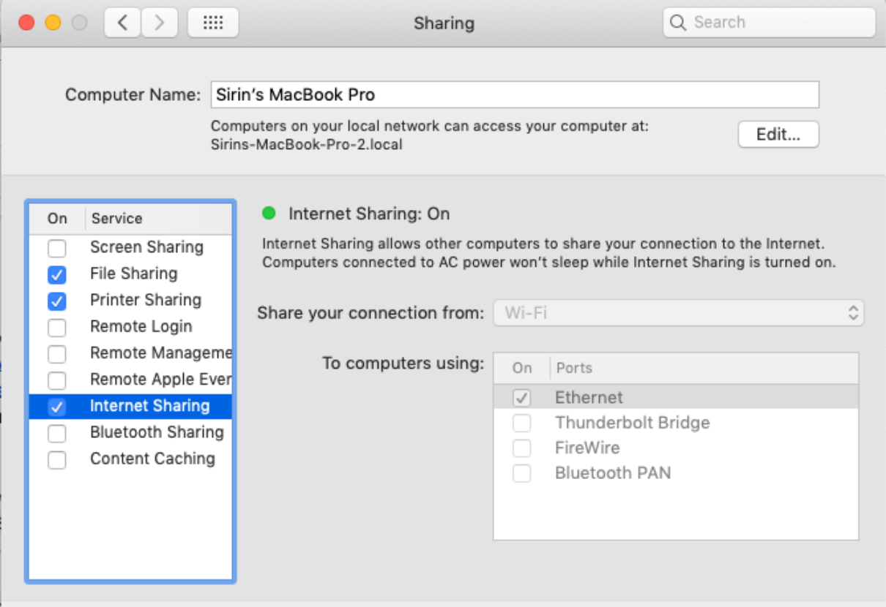

# First Boot

Now that we have set up the [SD card](image-setup-rpi3.md), we are going to boot up the board and connect it to your local network.

## Insert SD Card into the Board



## Supply Power to your Board

Do that by connecting a USB micro cable from your computer to your board:



If everything went well, the PWR led (red) should now turn on, while the ACT led (green) will continue blinking. That means the board is up and running.

## Setting up the Connection of your Board

This is only required if you have not already set up your [Wifi credentials](image-setup-rpi3.md#from-pantacor-hub), and will be necessary so you can [manage](choose-way.md) your device from your host computer. If you want to do it through Pantacor Hub, you will need to connect it to an Internet-facing network. In any case, you will have two options on your `Raspberry Pi`: WiFi or Ethernet.

### WiFi

If a network cable is not an option, you can use WiFi. To connect your Raspberry Pi to the WiFi network, provide the SSID and password to it. This can be accomplished with a smartphone or any other device with wireless capabilities.

The first step is to wait a couple of minutes after boot up until you find a connection with SSID "Wifi Connect" and no password in your computer or smartphone:



After you connect, a captive portal pops up on your phone:



Enter the portal, select the WiFi network and enter the password.



The Raspberry Pi now has your network credentials saved locally and will automatically connect to that SSID after every reset.



### Ethernet

The fastest way to connect your device to your network is with a cable. This can be done directly to your LAN or to your host computer.

#### Local Network

Plug one end of the Ethernet cable to your router or switch and the other into your Raspberry Pi.

#### Host Computer

Alternatively you can use your PC to set up an Ethernet connection for your Raspberry Pi, by connecting an Ethernet cable from your board to your computer.

After the board is up and LAN connection is on, the orange LED on the Ethernet cable should start blinking.



If you want to share your computer's Internet connection to the board, follow your OS specific instructions:

##### Linux

:::note
These instructions are for Ubuntu only.
:::

1. Click on the network icon and go to ```Edit Connections...```
2. Double click on your wired connection:
   + Switch to the ```IPv4 Settings``` tab
   + Select ```Shared to other computers``` method
   + Click on ```Save...```

##### Mac OS

1. Open System Preferences
2. Select Sharing Preference Panel
3. Enable Internet Sharing with the following settings:
   + Share your connection from: Wi-Fi
   + To computers using: Ethernet



##### Windows

1. Go to Network Connections
2. Open your WiFi connection's properties:
   + Switch to the ```Sharing``` tab
   + Enable it
   + Select Ethernet as the ```Home networking connection```
   + Click on ```Apply```

## What is next?

Our initial images come with a set of [containers](initial-devices.md#about-pantavisor-initial-devices) that will help you with the development process. If you want to install new containers and other types of device managemtn, you can proceed to [this page](choose-way.md).
