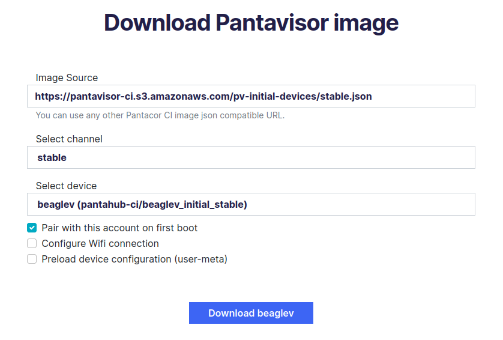
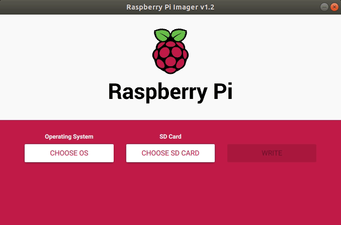
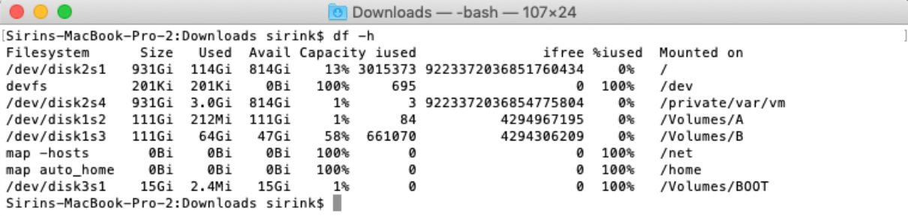
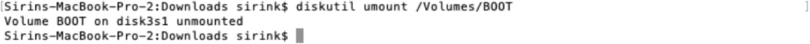
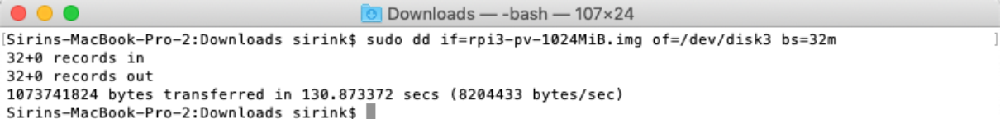
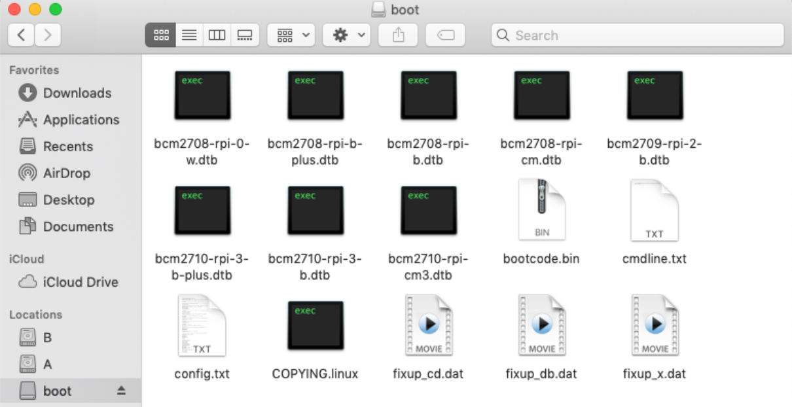

# Image Setup

First step is to download and flash our [pre-compiled image](initial-devices.md).

## Download Initial Image

Initial images come with the Pantavisor [BSP plus a set of Linux-based containers](initial-devices.md#about-pantavisor-initial-devices) that provide basic network connectivity, discovery services and development tools. As with any other of our initial images, there are two options for downloading them:

* [From Pantacor Hub](#from-pantacor-hub)
* [Non-Registering Option](#non-registering-option)

### From Pantacor Hub

This option requires [registration in Pantacor Hub](register-user.md). After that, visit the [Pantavisor image download page](https://hub.pantacor.com/download-image).



Select your `Raspberry Pi` device, the `stable` channel and `Pair with this account on first boot`. Optionally, select `Configure Wifi connection` to make further configuration steps easier.

### Non-Registering Option

If you prefer not to register, you can directly use a generic image from our [download page](initial-images.md).

Now find and download your `Raspberry Pi` version in the stable initial images list.

## Flash initial image

For most users, the [Raspberry Pi Imager](#raspberry-pi-imager), which is available for Linux, Mac OS and Windows, can flash our Pantavisor Image on to a micro SD card. Alternatively, check out the command line instructions for [Linux](#linux-commands) and [Mac OS](#mac-os-commands) to flash your device without additional software requirements.

### Raspberry Pi Imager

1. Download the [Raspberry Pi Imager](https://www.raspberrypi.org/software/).
2. Select the initial image downloaded previously.
3. Select your micro SD card and click write.



### Linux commands

Firstly, find the SD card device name using `df`:

```
df -h
```

Then, you can use the `dd` tool following these steps (remember to substitute `/dev/sdX` for the device node corresponding to your SD card, or else you will overwrite the wrong device!):

```
umount /dev/sdX*
gunzip -c  arm-rpi3.img.gz | sudo dd of=/dev/sdX bs=32M
sync
```

### Mac OS commands

For the Mac OS, the first step is to manually extract the `rpi3_initial_stable.img.xz` file. Then, find the SD card device name by opening a terminal and running the following command:

```
df -h
```



You can see on the bottom a 15 GB disk `/dev/disk3` is mounted on `/Volimes/BOOT`.

Unmount it and flash it with the `dd` tool (remember to substitute `/Volumes/BOOT` and `/dev/disk3` for the device node corresponding to your SD card):

```
diskutil umount /Volumes/BOOT
```



```
sudo dd if=arm-rpi3.img of=/dev/disk3 bs=32m
sync
```



Verify the image contents by opening the SD card partition named `boot`:


