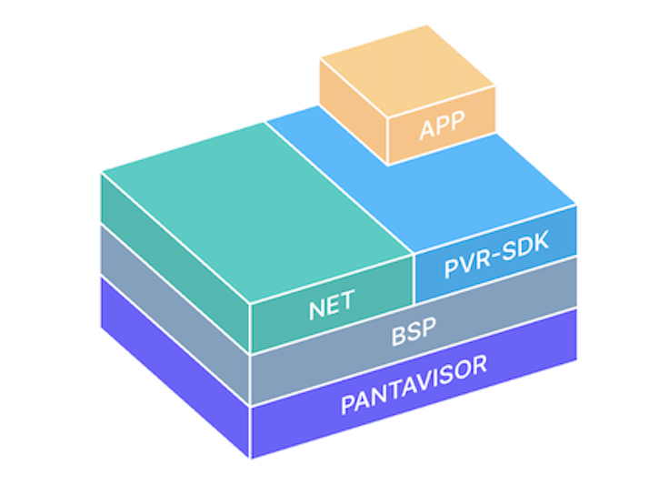

:::warning[Archived]
These pages are a snapshot of the **previous** Pantavisor documentation site,
kept for reference while content is migrated into the current sections. Some of
it may be outdated. For up-to-date material use the main sections above, and for
generated, versioned material see the [Reference](/reference/pantavisor).
:::

# What is Pantavisor? 

Pantavisor is a framework for building embedded Linux systems with lightweight LXC containers to create software-defined products for IoT.

## Introducing Pantavisor Linux and Pantacor Hub

Pantavisor Linux is a framework for building containerized embedded systems. It implements a version of lightweight Linux Containers (LXC), and is the easiest way to build a software-defined Linux Embedded product. With your Linux distribution or custom-made firmware userland in containers, your system gets the benefits of portable container lifecycle management without having to replace your distribution or worse, the board.

### Why Pantavisor Linux?

Pantavisor Linux creates the building blocks for a universal Linux non-OS that frees up your team so they can focus on features and services. It provides a simple way to deploy and manage your containerized embedded OS components across millions of devices in a portable and reproducible manner.

Pantavisor Linux can also convert Docker containers into LXC format to run on all types of devices and boards, including those with the smallest resource footprint. Turn firmware, the OS, and even the BSP into portable, cloud native, containerized building blocks that can be shared and deployed transactionally over the air. 

### Manage your system with containerized building blocks

Pantavisor Linux containerizes your firmware, the OS, the networking and even the Board Support Package (BSP) making them modular and portable building blocks that can be shared and managed atomically over the air. With everything containerized on the device, it’s simple to mix and match these components to build new distros and maintain any customizations you may have that are specific to your use case without having to replace your distro or worse, the entire board.

These are the base reusable building blocks that Pantavisor Linux modularizes and turns into containers:

* **Board Support Packages (BSPs)**: kernel, modules, and firmware. 
* **System Middleware Containers**: you can choose to package your monolithic distro middleware in one container or build your middleware into more fine-grained units. 
* **Apps**: Run them as LXC or Linux containers. Can also convert and run Docker containers. 
* **Configuration**: system level configuration

## What is Pantacor Hub?

Pantacor Hub is the open source device state management system. You can think of it as a cross between an image sharing repository for apps and devices as well as a device system revision repository.  The hub allows you to share images and device data between team members or other users. It also manages the atomic revisions of the device state for over the air updates across device fleets and you can configure device and application meta-data.  
