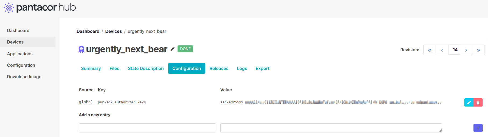

# Inspect your Device

To locally handle your device, it is necessary to remotely access it via [SSH](#ssh), [TTY](#tty) or by [any other means](#keyboard-and-monitor) from your host computer, as Pantavisor offers management capabilities from the device itself.

## SSH

:::note
Knowing your device IP is necesary to SSH it. You can get the IP from the [Pantacor Hub device dashboard](ph-device-dashboard.md), by using [pvr](pvr-discover-device.md), [TTY inspection](#tty) or with [keyboard and monitor](#keyboard-and-monitor). Other options non related to our tooling are navigating to your router admin page or using [arp-scan](https://linux.die.net/man/1/arp-scan).
:::

If your device has the [pvr-sdk container](pvr-sdk-reference.md) installed and it is not yet [claimed](claim-device.md), you can SSH the device using [password authentication](#password) and then set a [public key](#public-key) for further use.

If your device is already [claimed](claim-device.md), you can directly set your SSH [public key](#public-key).

### Password

The [pvr-sdk container](pvr-sdk-reference.md) sets up a password-accessible SSH server by default. To log in, just type this command:

:::warning
Make sure you use your own device IP.
:::

```
ssh root@10.0.0.1
```

When prompted, log in with the password `pantabox`.

### Public Key

We will have to create an SSH public key and set it up in your [user metadata](storage.md#user-metadata). From your Linux host, you can create an SSH pair and print your public key with these commands:

```
ssh-keygen -t ed25519 -C "your_email@example.com"
cat ~/.ssh/id_ed25519.pub
```

Now, the process varies depending whether your device is [claimed](claim-device.md) or not. In case it is, [create a new user metadata pair](set-device-metadata.md) with the [pvr-sdk.authorized_keys key](pantavisor-metadata.md#user-metadata):

```
key: pvr-sdk.authorized_keys
value: <ssh pub id>
```



If your device is not claimed in Pantacor Hub, you can access your device with the [password authentication method](#password) and then set the [user metadata](storage.md#user-metadata) pair with the SSH public key using the [Pantabox](pantabox-introduction.md) `pantabox-edit-sshkeys` command.

:::warning
It is important to remember that the device [user metadata](storage.md#user-metadata) can only be edited using `pantabox-edit-sshkeys` if the device is in not under [remote control](remote-control.md). In that case all the user metadata stored in the device will be automatically overloaded from the one that is [stored](set-device-metadata.md) in Pantacor Hub.
:::

Once your SSH public key is stored in your device, the Dropbear SSH server should be accessible at port 8222 and with the desired container name as user:

:::warning
Make sure you use your own device IP.
:::

```
ssh -p 8222 alpine-hotspot@10.0.0.1
```

Furthermore, you can directly reach [Pantavisor console](navigating-console.md#pantavisor-console) using the "/" user:

```
ssh -p 8222 /@10.0.0.1
```

## TTY

:::note
Not all our [initial devices](initial-devices.md) are baked to open a TTY channel out of the box. One example when this TTY is set is the [RPi4 board](board-troubleshooting-rpi3.md#tty).
:::

An alternative to the network accessed option is getting into Pantavisor through a TTY shell. This will grant an earlier access than [SSH](#ssh) and will not require any further configuration on the device side besides connecting the hardware, plus giving access to the [bootloader console](navigating-console.md#bootloader-console).

To open a TTY console in your host, you can use `minicom`:

```
sudo minicom -D /dev/ttyUSB0
```

After booting up, you will have two chances to stop the boot up and get a shell that will allow you to interact with the boot up process. First one will be before the bootloader loads the kernel and Pantavisor. If you press any key during when prompted, you will get to the [bootloader shell](navigating-console.md#bootloader-console):

```
U-Boot 2016.09-g15600e2 (Jan 15 2021 - 16:18:19 +0000)

Board: MIPS Malta CoreLV
DRAM:  128 MiB
Flash: 16 MiB
In:    serial@3f8
Out:   serial@3f8
Err:   serial@3f8
Net:   pcnet#0
Warning: pcnet#0 MAC addresses don't match:
Address in SROM is         02:b8:2a:7f:48:b6
Address in environment is  52:54:00:12:34:56
, pcnet#1
Hit any key to stop autoboot:  0 
malta #
```

From here, you will be able to [set Linux environment variables]() that will let you configure some [Pantavisor parameters](pantavisor-configuration-levels.md#environment-variables).

After kernel and Pantavisor is loaded, you can also access Pantavisor user space from an [ash shell](navigating-console.md#pantavisor-console). For that, just press `d` when prompted:

```
[    1.685794] Run /init as init process
Press [d] for debug ash shell... 5 d

#
```

Pantavisor will prevent rebooting or powering off the device while the debug shell is open. This will allow to debug [faulty revisions](updates.md#error) that might need a rollback. To enable reboot and power off again, use `exit` command or press CTRL-d to close the shell.

:::note
The debug shell countdown can be disabled so it is always entered without waiting for user confirmation. See the `PV_DEBUG_SHELL_AUTOLOGIN` key at [Pantavisor configuration reference](pantavisor-configuration.md#summary). Just remember to exit the console if you are waiting for a board reboot. It can also be disabled completely to speed up the bootup process. To do so, use the `debug.shell` key.
:::

## Keyboard and Monitor

:::note
Not all our [initial devices](initial-devices.md) have HDMI and keyboard control enabled. One example when this is set is the [RPi4 board](board-troubleshooting-rpi3.md#hdmi-cable).
:::

If you have a keyboard and a monitor at hand, you will get a similar workflow as with the [TTY](#tty), with access both to the [bootloader console](navigating-console.md#bootloader-console) and the Pantavisor [debug shell](navigating-console.md#pantavisor-console).
