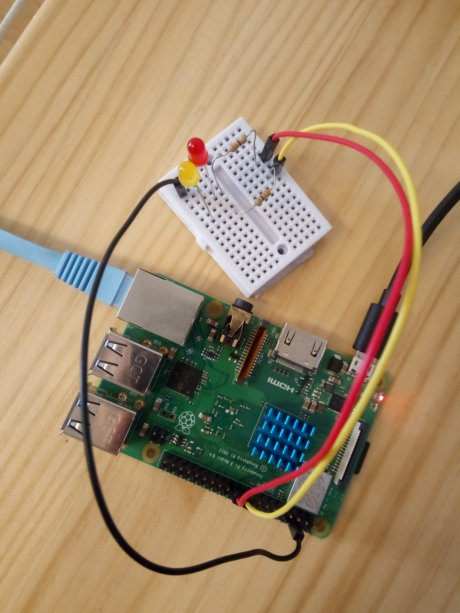

# Installing App on Pantavisor Device for GPIO management via Pantacor Hub

In this tutorial, we are going to flash and claim a Pantavisor device to our Pantacor Hub account. Then, we are going to install a simple container in it with GPIO setting capabilities that can read cloud-controlled Pantacor Hub input metadata. All these elements will be combined to demonstrate how you can interact with your device peripherals (in this case, GPIO) from our Pantacor Hub user interface.

## What you will need

To flash and claim your Pantavisor device on Pantacor Hub:

* Raspberry Pi 3 B+
* Power cable for RPi3
* Internet-facing Ethernet cable
* Your computer

Also, you will need this hardware to test the GPIOs (see [figure](#set-up-hardware)):

* One or more LEDs
* 330 ohm resistor for each LED (anything over about 50 ohm would work)
* One female to male breadboard jumper wires per LED plus an additional one for GND
* Breadboard

## Instructions

1. [Set up hardware](#set-up-hardware)
2. [Flash and claim](#flash-and-claim)
3. [Install GPIO App](#install-gpio-app)
4. [Test it](#test-it)
5. [Go further](#go-further)

### Set up hardware

You have to firstly set up your LED circuit. In [raspberrypi.org](https://www.raspberrypi.org), you have access to the [GPIO reference](https://www.raspberrypi.org/documentation/usage/gpio/) to identify where are the GPIO pins and GND on the board. Furthermore, you can see how to connect a LED to the board [here](https://projects.raspberrypi.org/en/projects/physical-computing/3).

Take a look at our set up in this image:



For this example, we are going to use GPIO 9 (red LED) and GPIO 10 (yellow LED).

### Flash and claim

Now, you must go through our [prerequisites](install-pvr.md) and [get started](get-started.md) tutorials.

Once you have your RPi3 running with Pantavisor and you can access its cloud representation in Pantacor Hub, you can continue to the next step.

### Install GPIO app

Go ahead and [clone](clone-your-system.md) your device checkout to your host computer.

What we are going to do now, is to install an app that let you set and unset your device's GPIO. We have prepared a shell script inside a Docker container, which can be deployed to an ARMv6 device with Pantavisor (like your RPi3). We are going to do this using the ```pvr``` tool from your host computer.

First, _cd_ to your cloned device checkout and execute the following commands:

```
cd ../<clone-checkout> # your cloned device repesentation
fakeroot pvr app add --from registry.gitlab.com/pantacor/pv-platforms/rpi-gpio:ARM32V6 gpio
pvr add .
pvr commit
pvr post
```

This will automatically commit the new app and post it to the device, which will then process the update. You can follow this process on Pantacor Hub, checking out the console of your device. Once the device is in _done_ state, you will be ready to test it.

:::note
Check the source code of the container you just installed [here](https://gitlab.com/pantacor/pv-platforms/rpi-gpio). Have in mind that we are natively running this container on Pantavisor, and that we only use Docker for the app definition.
:::

### Test it

In order to test it, you can go to your [device metadata](set-device-metadata.md) panel in Pantacor Hub. This is the pair used by the app we just installed.

```
key: gpio/<gpio-number>
value: 0 or 1
```

For our example, we are going to set GPIOs 9 and 10 to turn on the red and yellow LEDs:


### Go further

You can make changes to this app by cloning the _rpi-gpio_ repository and building its dockerfile locally. As the app is a pure Bash one, any x86 laptop can build and deploy the container using ```pvr app add```. For example, to locally build and update the app, we could do:

```
cd ..
git clone https://gitlab.com/pantacor/pv-platforms/rpi-gpio.git
cd rpi-gpio
docker build -t demos:gpio -f Dockerfile.ARM32V6 .
cd ../<clone-checkout> # your cloned device
rm -r gpio
fakeroot pvr app add --from demos:gpio gpio
pvr add .
pvr commit
pvr post
```

You can iterate the above by making changes to the Docker container. I.e: change the gpio.sh script so the LED blinks when set in the device metadata. After editing the shell script:

```
cd ../rpi-gpio
docker build -t demos:gpio -f Dockerfile.ARM32V6 .
cd ../<clone-checkout>
fakeroot pvr app update gpio
pvr commit
pvr post
```
