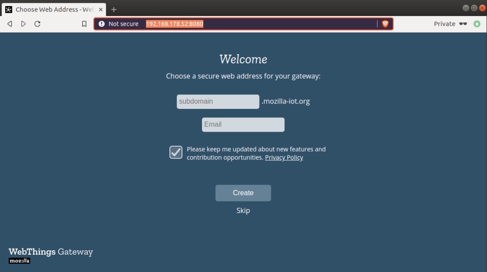

## Mozilla Iot Gateway as a Pantavisor App

Mozilla IoT Gateway allows you to manage WebThings directly on your device.

To get started, download a Pantavisor enabled base image for your preferred device and
add Mozilla WebThings Gateway to it.

First clone your device from Pantacor Hub:

```
pvr clone YOURNICK/YOURDEVICE
cd YOURDEVICE
```

Then add the WebThings gateway from docker:

```
pvr app add \
	--volume=lxc-overlay:revision \
	--volume=/home/node/.mozilla-iot:permanent \
	--from=mozillaiot/gateway:arm gateway
```

Note: We make the mozilla-iot datafolder volume go to permanent storage that will persist across reboots and
revisions. The general overlay used to make the whole container filesystem read write however we only persist
for revisions, that means on upgrade you won't have to worry about potential dirt that got left behind.

Now commit and post it to your device:

```
pvr add .
pvr commit
pvr post -m "add mozilla iot gateway" YOURNICK/YOURDEVICE
```

This will trigger a reboot of your device and afterwards you will be able to use WebThings gateway
at the IP address of your gateway.

## Screenshots


