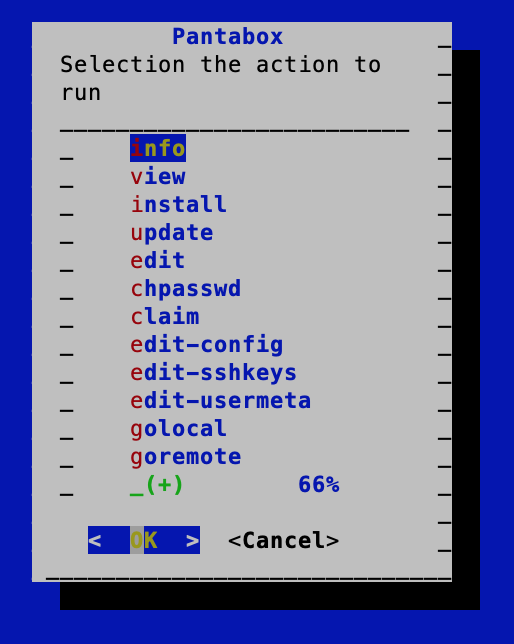
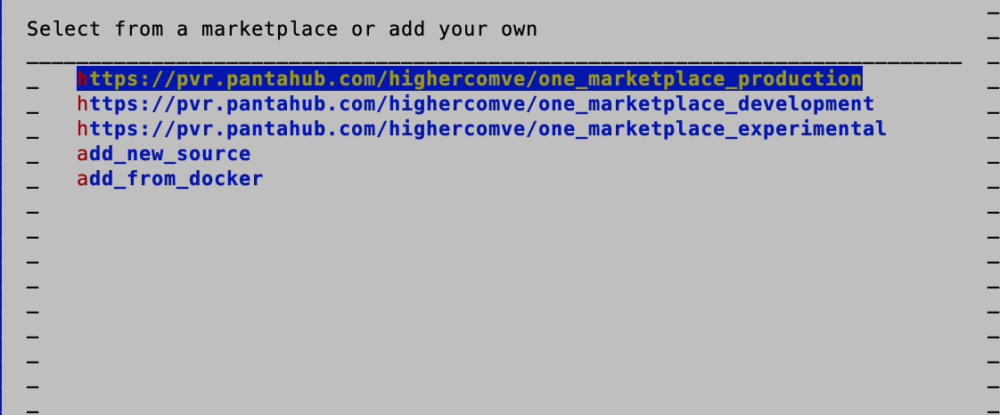
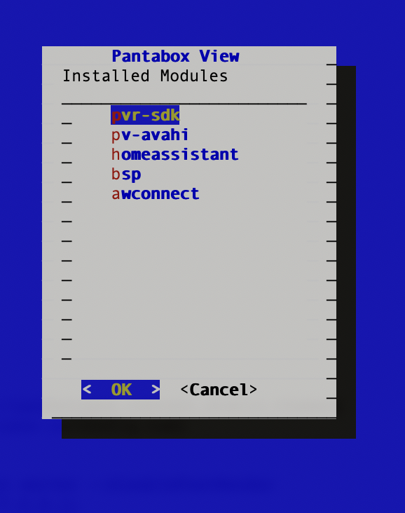

# Add Apps from Marketplace

:::note
An app is a [container](containers.md) that can be run in a Pantavisor device that takes part on the application level functionality.
:::

Pantabox offers the possibility to add apps from a Marketplace without going through the cloud. First, execute the `pantabox` command to get its menu:



Select the `install` option on the menu and you will get this:



This lets you install containers from the Pantacor One Marketplace or from one of your own. Choose the Pantacor One Marketplace. A list of selectable apps will appear where you can make your changes and press `OK`.

If you now run `pantabox` and select `view`, you will see see the new [revision](revisions.md) components:



To add, commit and apply your changes, execute these commands:

```
pvr add .
pvr commit
exit 0
```
