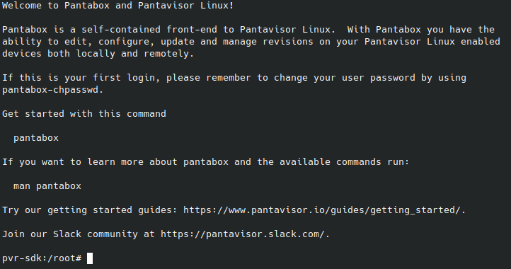

# Using Pantabox

Pantabox allows to [interact](local-control.md#pantabox) with Pantavisor from [inside](inspect-device.md) of the device.

Pantabox is included by default in the [pvr-sdk](initial-devices.md#about-pantavisor-initial-devices) container, so to begin using it, you just have to access the running instance of pvr-sdk in your device. For example, to do it via [SSH](inspect-device.md#public-key):

```
ssh -p 8222 pvr-sdk@10.0.0.1
```

Once you are in, you will find instructions on how to use Pantabox:


