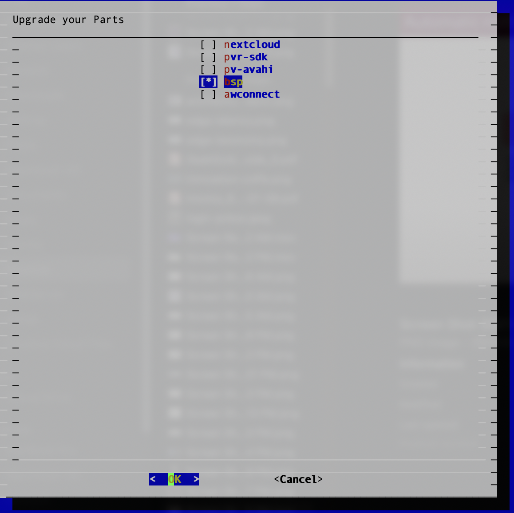

# Update your BSP

You can also update your BSP or any installed container with Pantabox.

Run the `pantabox` command and select `update`. Then, select the `BSP`:

Pantabox will update the selected elements and run the new revision. Pantavisor will test and [rollback](updates.md#error) to a previous revision if needed.
