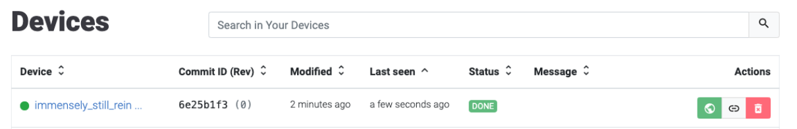

# Device Dashboard

Assuming the [claiming](claim-device.md) process has been successful, the new device should appear in the device list of your Pantacor Hub account:

If you click on the name of the new device, you will access to the device dashboard:

From the dashboard you can perform some simple management operations:

* Get the `Clone URL` that [pvr](install-pvr.md) can use to send new [revisions](revisions.md) to the device
* Get the `Share URL` so you or others can get a direct link to the device dashboard
* Check the device [status](updates.md) and containers
* Check [metadata](storage.md#device-metadata) sent by the device (storage and memory use, system information, Pantavisor state, etc.)
* Check the [JSON state](revisions.md) and revision artifacts
* [Set](set-device-metadata.md) user [metadata](storage.md#user-metadata) to the device
* [Redeploy](recover-from-broken-revision.md) old revisions
* [Get](get-the-logs.md) the [logs](storage.md#logs) pushed by the device
