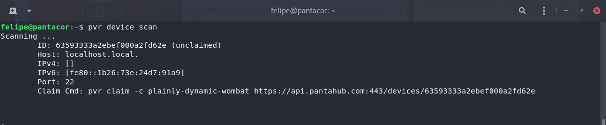

# Discover your Device

You can use `pvr` to discover your running devices in your local network.

:::note
This assumes the device is running the [pv-avahi](initial-devices.md#about-pantavisor-initial-devices) container, as is the case with our initial images, and that your computer is connected to the same local network.
:::

To list the devices in your local network, just execute:

```
pvr scan
```



As you can see, [claiming](claim-device.md) information is provided for non-claimed devices for [remote](remote-control.md) managemt. This can be ignored though, if you prefer to [locally](local-control.md) manage it.
