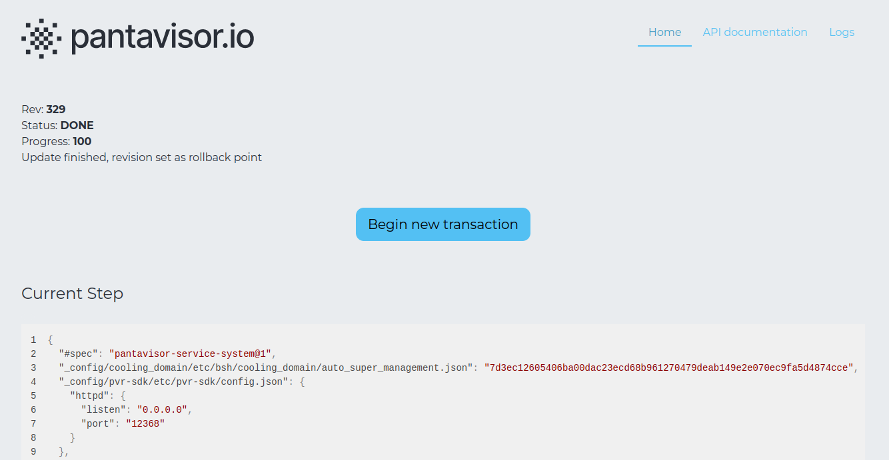

# Using pvtx

To access the `pvtx` UI, just make sure your host computer is in the same network and access this URL from your web browser. Make sure to use your device IP and [configured port](pvtx-open-api.md):

```
http://192.168.2.55:12368/app/
```

This will get you access to the `pvtx` UI, where you can see some basic device info, make changes on the running [revision](revisions.md) and inspect the [logs](storage.md#logs).


