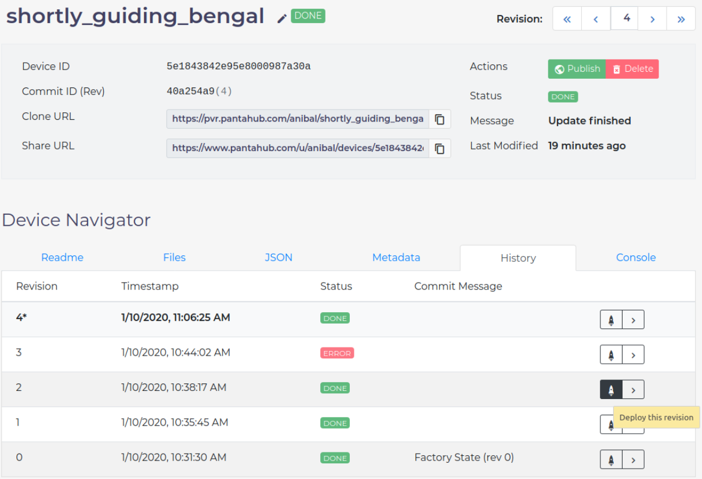

# Redeploy Old Versions

Pantavisor will automatically [rollback](updates.md#error) to a previous revision if a newly pushed version does not permit a stable connection with Pantacor Hub.

Besides that, you can redeploy an old revision using the Pantacor Hub UI. Just go to your [device dashboard](ph-device-dashboard.md) and click in the `Releases` tab, where you will find a list of [revisions](revisions.md) with their time-stamp, status and commit message. At the right column, you have two buttons: one for redeploying that revision, the other one for navigating to that revision in the UI.

The current revision number will be automatically updated by the device along other [metadata](storage.md#device-metadata) and can be consulted from the dashboard.
