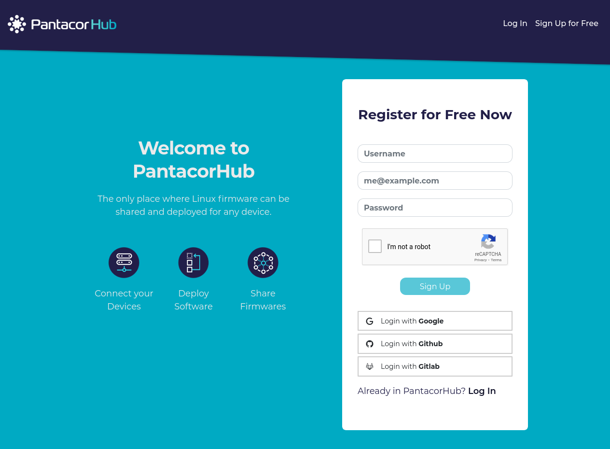

# Sign up to Pantacor Hub

:::note
This is only necessary if you want to [remotely control](remote-control.md#pantacor-hub) your devices from [Pantacor Hub](index.md#what-is-pantacor-hub). If you prefer to follow the [local experience](local-control.md) path, then just skip this page.
:::

The first thing you need to do to interact with [https://hub.pantacor.com](https://hub.pantacor.com) is to register a user account. A user account gives you access to the full API, including the object store, and also grants you access to its dashboard.

You can sign up in the [Pantacor Hub](https://hub.pantacor.com) web interface, with the [pvr](install-pvr.md) tool from the host or with the [pantabox](local-control.md#pantabox) tool from the device.

:::note
After registering your account, make sure to follow the instruction in the verification email. Your account is not ready for use until it is verified.
:::

## Registering on the web 

Visit the Pantacor Hub starting page at <https://hub.pantacor.com> and follow the sign-up process. You have the option of signing up with your email address or with your Google, GitHub or GitLab account.



## Registering with pvr

You can use the following [pvr](install-pvr.md) command to register a user:

```
pvr register -u youruser -p yourpassword -e your@email.tld
```

This will generate a json response with the server-generated part of the credentials:

```
2017/06/19 11:08:43 Registration Response: {
  "id": "5947949b85188a000c143c2e",
  "type": "USER",
  "email": "your@email.tld",
  "nick": "youruser",
  "prn": "prn:::accounts:/5947949b85188a000c143c2e",
  "password": "yourpassword",
  "time-created": "2017-06-19T09:08:43.767224118Z",
  "time-modified": "2017-06-19T09:08:43.767224118Z"
}
```
## Registering with pantabox

To register through [pantabox](inspect-device.md), you must have already downloaded an initial precompiled image and flashed your device. So, firstly, you will have to make it [ready](before-you-begin.md#preparing-your-device).

After you have [logged in](inspect-device.md) your device, register and [claim](claim-device.md) the device using the [pantabox](local-control.md#pantabox) command.

```
pantabox-claim
```
