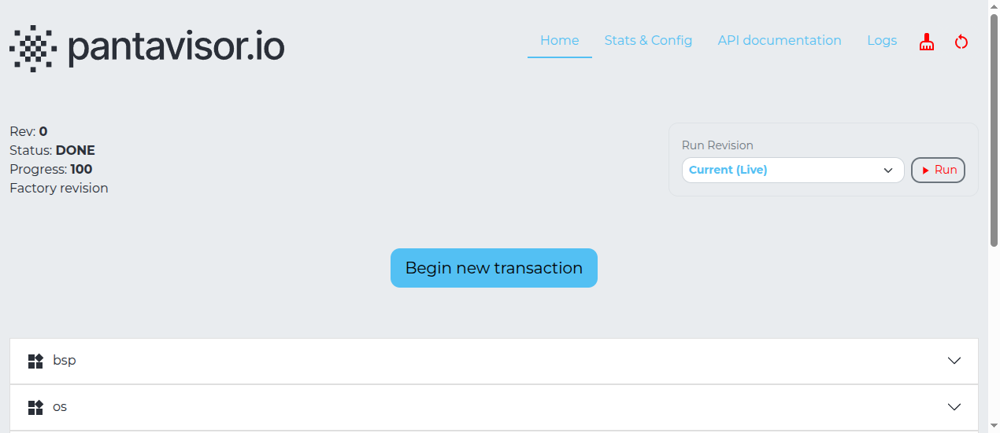

You can inspect running containers, their health state, and their logs from the device console, the `pvcontrol` CLI, or the pvtx local web UI.

## Quick Container List

On the device console (serial or SSH), `lxc-ls -f` shows all containers and their LXC state:

```bash
lxc-ls -f
```

Example output:

```
NAME            STATE   AUTOSTART GROUPS IPV4 IPV6 UNPRIVILEGED
bsp             RUNNING 0         -      -    -    false
network         RUNNING 0         -      -    -    false
sensor-app      RUNNING 0         -      -    -    false
```

## Full Device Status with pvcontrol

`pvcontrol ls` shows the Pantavisor view of each container: its name, group, status, status goal, and restart policy:

```bash
pvcontrol ls
```

More targeted sub-commands:

```bash
pvcontrol container ls          # containers and their Pantavisor status
pvcontrol daemons ls            # long-running daemon containers
pvcontrol groups ls             # container groups and their restart policy
pvcontrol graph ls              # active pv-xconnect service mesh links
pvcontrol buildinfo             # Pantavisor build and revision info
```

`pvcontrol container stop <name>` and `pvcontrol container start <name>` let you stop or restart individual containers without deploying a new revision — useful during development.

## Viewing Logs

Pantavisor writes container console output and LXC logs to the storage partition, organized by revision. From inside a container (for example an SSH session into pvr-sdk) the paths are below; from the [serial debug shell](/operate/device-access/serial-port) the same tree is at `/pv/logs/`.

| Log | Path |
|-----|------|
| Pantavisor runtime | `/pantavisor/logs/<revision>/pantavisor/pantavisor.log` |
| Container console | `/pantavisor/logs/<revision>/<container>/lxc/console.log` |
| LXC internal log | `/pantavisor/logs/<revision>/<container>/lxc/lxc.log` |

Tail a container's console log in real time:

```bash
tail -f /pantavisor/logs/<revision>/sensor-app/lxc/console.log
```

Check the Pantavisor runtime log for OTA update progress or auto-recovery events:

```bash
tail -f /pantavisor/logs/<revision>/pantavisor/pantavisor.log
```

## Using the pvtx Web UI

The pvtx UI is served directly from the device on port **12368**. Open a browser and navigate to:

```
http://<device-ip>:12368/app
```

The homepage shows all running containers and the current revision state. You can also view the revision history and start update transactions from this interface.


