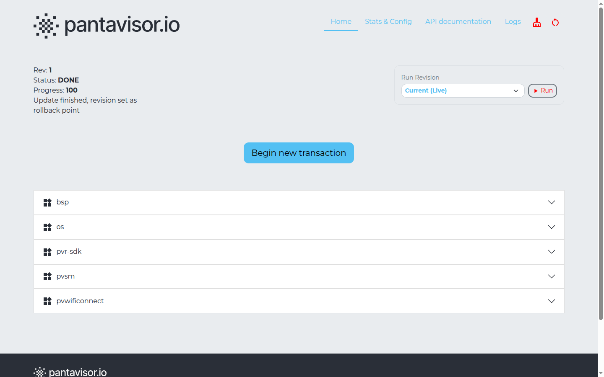
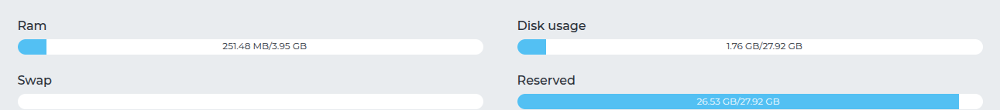
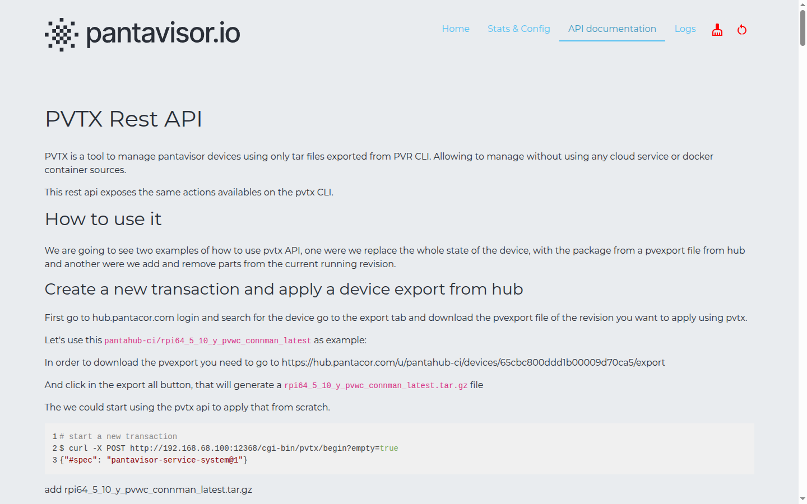
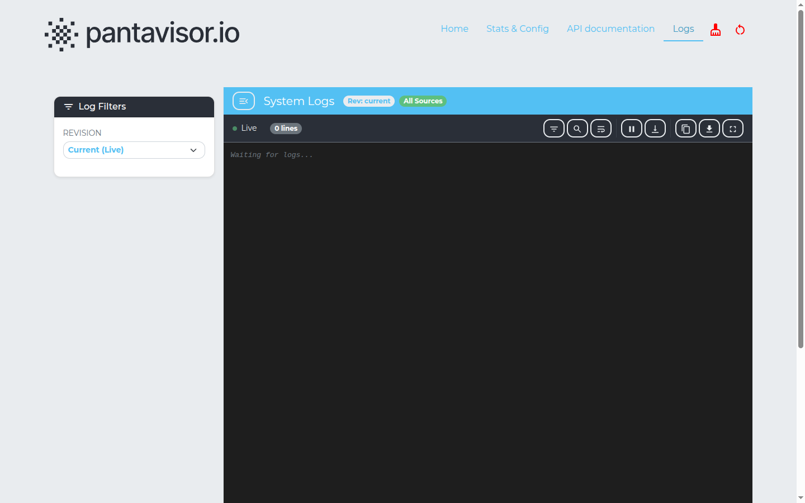

The **pvtx app** is a web interface served directly from the device on port **12368**. It gives you a browser-based view of the device's revisions, containers, resource usage, configuration, the on-device REST API, and live logs — without the `pvr` CLI or SSH.

Open a browser and navigate to:

```
http://<device-ip>:12368/app/
```

The top navigation has four pages: **Home**, **Stats & Config**, **API documentation**, and **Logs**.

---

## Home — revision state and transactions

The **Home** page shows the device's current revision and lets you switch revisions or start a transaction.



Top-left status block:

- **Rev** — the current revision number in the device's trail.
- **Status** — `DONE` means the current revision is committed and stable. Other states (e.g. `TESTING`) appear while a revision is being evaluated.
- **Progress** — completion percentage of the current update or boot sequence.
- A status line such as *"Update finished, revision set as rollback point"*.

**Run Revision** (top-right) — a dropdown to select a revision (`Current (Live)`, `Rev 0`, `Rev 1`, …) and a **Run** button to boot into it.

**Begin new transaction** — starts a staged update you can apply from a `pvexport`/`.tar.gz` package (see [API documentation](#api-documentation--the-pvtx-rest-api) below for the underlying calls).

**Containers** — each component on the device is an expandable row. On a typical image these include `bsp`, `os`, `pvr-sdk`, `pvsm`, and application containers such as `pvwificonnect`.

---

## Stats & Config

The **Stats & Config** page shows live resource usage, device metadata, and the device configuration.

### Device stats



| Field | Description |
|-------|-------------|
| RAM | Used / total memory |
| Swap | Swap space usage |
| Disk usage | Storage partition used / total |
| Reserved | Storage reserved by Pantavisor |

### Device Meta and Device Config

Below the stats are two tables:

- **Device Meta** — read-only, device-reported values: network interfaces (`interfaces.<iface>.ipv4/ipv6`), Pantahub connectivity (`pantahub.claimed`, `pantahub.online`, `pantahub.state`), platform info (`pantavisor.arch`, `pantavisor.dtmodel`, `pantavisor.version`, kernel `uname`), and storage/sysinfo counters. You can also add your own user-metadata key/value entries here.
- **Device Config** — the active Pantavisor configuration keys (for example `creds.host`/`creds.port`, `secureboot.mode`, `wdt.timeout`, `updater.interval`, log and storage paths).

> **⚠️ Warning — Sensitive values**
>
> Device Meta and Device Config include credentials and identifiers (e.g. `creds.id`, `creds.prn`, `creds.secret`, and SSH `authorized_keys`). Treat this page as sensitive and avoid sharing screenshots of it. (That is why only the resource-stats section is shown above.)

---

## API documentation — the pvtx REST API

The **API documentation** page documents the on-device **PVTX REST API** — the same actions available from the `pvtx` CLI, exposed over HTTP so you can manage the device without any cloud service — you upload pvr export packages directly to the device.



It walks through two workflows with runnable `curl` examples:

- **Replace the whole device state** from a `pvexport` package downloaded from Pantahub.
- **Add or remove parts** of the current running revision.

For example, starting a fresh transaction:

```bash
curl -X POST "http://<device-ip>:12368/cgi-bin/pvtx/begin?empty=true"
```

---

## Logs

The **Logs** page streams Pantavisor runtime and container logs directly in the browser.



- **Log Filters** (left) — choose the **revision** to view logs for (`Current (Live)` or a specific revision).
- **System Logs** header — shows the selected revision and source scope (e.g. **All Sources**), with a **Live** indicator and line count.
- **Toolbar** (top-right of the log pane) — filter, search, pause/resume the live stream, download, copy, and full-screen.

This view mirrors the on-device log files under `/pantavisor/logs` (configurable via the `log.dir` config key).
